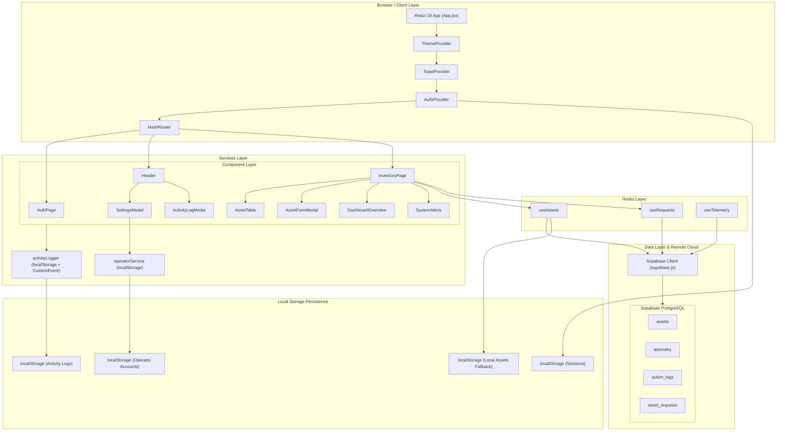

# InfraNode | Enterprise Asset Governance System

> **Enterprise Infrastructure & Asset Health Governance Platform**  
> A real-time, browser-based dashboard engineered for IT asset lifecycle tracking, hardware telemetry monitoring, equipment request workflows, and role-based clearance governance.

[](https://react.dev/)
[](https://vite.dev/)
[](https://supabase.com/)
[](https://lucide.dev/)
[](LICENSE)

> **Live Demo:** [https://infranode.riyadhalmahmud.tech](https://infranode.riyadhalmahmud.tech)

---


## Introduction

**InfraNode Dashboard** is a full-stack, browser-based IT asset and infrastructure health dashboard designed for enterprise IT teams. It provides real-time visibility into hardware inventory, asset lifecycle status, telemetry health signals, system alerts, and equipment procurement requests — all from a single, unified interface. 

The project was built as a portfolio piece to demonstrate senior-level skills in React 19, Supabase, role-based access control (RBAC), and real-world data management patterns.

---

## Problem Statement

IT and infrastructure teams in small-to-mid-size enterprises frequently struggle with fragmented tooling: asset registers live in Excel spreadsheets, equipment request forms are sent via email, and health status monitoring is either absent or siloed in expensive enterprise tools. 

There is no single low-cost, accessible view that consolidates asset inventory, lifecycle tracking (warranty/end-of-life), procurement requests, and system alerts. InfraNode solves this by providing a unified, self-hosted dashboard that any IT operator or administrator can run with only a Supabase project and a web browser.

---

## Target Audience

- **IT Administrators and Infrastructure Engineers** managing physical and virtual hardware assets.
- **System Operators** who require real-time telemetry signals and health status monitoring.
- **IT Managers** responsible for reviewing and approving equipment procurement requests.
- **Small-to-Mid-Size Enterprises (SMEs)** seeking a low-cost, accessible alternative to expensive enterprise ITSM suites.
- **Portfolio Reviewers and Technical Recruiters** evaluating production-ready, full-stack React capabilities.

---

## Core Functionalities

### 1. Asset Inventory Management
- **Full CRUD Operations**: Create, read, update, and delete hardware assets with instant state sync.
- **Categorization & Statuses**: Supports 10 distinct categories (*Server, Network, Storage, Power, Workstation, Laptop, Security/Firewall, Cloud/Virtual, Peripheral, Software License*) across 4 operational statuses (*Active, Warning, Critical, Decommissioned*).
- **Search & Export**: Features debounced live search, category and status filtering, and one-click CSV export.

### 2. Automatic Asset Lifecycle Alerts
- **Past EOL Escalation**: Assets exceeding their End-of-Life date are automatically escalated to **Critical**.
- **Proactive EOL Warning**: Assets within 14 days of End-of-Life are automatically flagged as **Warning**.

### 3. Interactive Dashboard Overview
- **Dynamic Charts**: Powered by Recharts, offering sorted visual summaries of Asset Status and Request Status.
- **System Alerts Panel**: Clickable severity-sorted alerts panel providing immediate contextual diagnostics.

### 4. Live Telemetry Monitoring
- **Background Telemetry Sync**: Real-time hardware telemetry data (CPU temperature, voltage, utilization) is fetched continuously from the Supabase `telemetry` table via custom hooks.
- *(Note: Telemetry data is synchronized in the data layer but currently decoupled from the main dashboard UI panel.)*

### 5. Equipment Request Management
- **Employee Submissions**: Employees can request hardware specifying item details, business justification, and urgency (*Low, Medium, High, Critical*).
- **Administrator Review Modal**: Admins can approve, reject, or delete requests via a review modal.
- **Request Lifecycle**: Full status state flow: `Pending` ➔ `Approved` / `Rejected` ➔ `Fulfilled`.

### 6. Role-Based Access Control (RBAC)
- **Clearance Profiles**: Supports **Administrator** and **Employee** roles.
- **Administrator**: Unrestricted access to all features, settings, operator management, activity logs, and request approvals. *(Note: The primary Admin account is permanently hardcoded; only Employee accounts can be created or deleted in Settings).*
- **Employee**: Access restricted to viewing inventory and submitting equipment requests. Employees can edit and delete only the assets they personally created.

### 7. Activity Log & Audit Trail
- **Comprehensive Logging**: Automatically logs all system actions including logins, logouts, asset modifications, request decisions, and account changes.
- **Audit Modal**: Admin-only modal displaying timestamps, actor identity, action type, and category.
- **Export & Maintenance**: Log entries can be cleared or exported as a CSV report.

### 8. Non-Blocking Toast Notifications
- **Immediate Feedforward**: A custom toast notification system provides immediate, non-blocking feedforward for all user interactions, ensuring users are always aware of system states (success, errors, updates).

### 9. Offline-First Hybrid Data Layer
- **Resilient Fallback**: Merges Supabase remote database records with local state in `localStorage`.
- **High Availability**: Ensures instant optimistic UI updates and background synchronization even if Supabase is temporarily unreachable.

---

## System Architecture

### 1. Mermaid Architecture Diagram



### 2. Architectural Overview

**Frontend Component Structure**  
The application is built on React 19 and structured around single-responsibility layout, component, and context modules. State is encapsulated in custom hooks (`useAssets`, `useRequests`, `useTelemetry`) that separate data-fetching logic from presentational components. Global application state—such as authentication clearance, theme tokens, and non-blocking toast notifications—is managed via top-level React Context providers.

**Database Design**  
The backend is powered by Supabase PostgreSQL comprising four primary tables:
1. `assets`: Stores core inventory records, serial tags, categories, operational statuses, location allocations, and End-of-Life timestamps.
2. `telemetry`: Stores continuous hardware health metrics (temperature, voltage, CPU utilization) indexed by asset ID.
3. `action_logs`: Created in schema for future expansion (currently, system logs are strictly maintained in local storage).
4. `asset_requests`: Stores employee equipment procurement requests, justifications, urgency levels, and approval states.

**Real-Time Subscriptions**  
Uses Supabase Broadcast channels (`sync-assets-room`) to emit events and sync asset changes instantly across multiple active client sessions without waiting for polling intervals.

**Authentication & Role Clearance**  
Authentication is managed via an integrated session context that handles clearance profiles for Administrator and Employee roles. Clearance checks are enforced at both the UI layer (suppressing restricted buttons and routing to `/login` via protected wrappers) and the action layer (preventing unauthorized modifications of assets owned by other users).

**Offline-First Data Flow**  
To ensure high availability, the application employs a hybrid data layer. Data hooks perform optimistic UI updates locally while dispatching asynchronous mutations to Supabase. If remote connectivity is lost or unconfigured, the application seamlessly falls back to `localStorage` caching, ensuring zero disruption to client operations.

---

## Local Setup & Installation

Follow these numbered steps to run the application locally:

**Prerequisites:** Node.js v18+, npm, Git, free Supabase account.

1. **Clone the repository and install dependencies:**
   ```bash
   git clone https://github.com/r7riyadh/infranode-dashboard.git
   cd infranode-dashboard
   npm install
   ```

2. **Set up the Supabase database:**  
   Create a project on [Supabase](https://supabase.com), open the **SQL Editor**, and run the entire script in `supabase/schema.sql`.

3. **Configure environment variables:**
   ```bash
   cp .env.example .env
   ```
   Fill in your `VITE_SUPABASE_URL` and `VITE_SUPABASE_ANON_KEY` in `.env` (obtained from **Supabase ➔ Settings ➔ API**).

4. **Start the development server:**
   ```bash
   npm run dev
   ```

5. **Access default login credentials:**

   | Role | Username | Password |
   | :--- | :--- | :--- |
   | **Administrator** | `admin` | `admin` |
   | **Employee** | `meaw` | `meaw` |

---

## Security Overview

### What is Implemented

- **Role-Based Access Control (RBAC)**: Admin-only actions and clearance checks gated by authenticated user role.
- **Route Protection**: ProtectedRoute component redirects unauthenticated visits to `/login`.
- **Row Level Security (RLS)**: RLS enabled across all four Supabase tables (`assets`, `telemetry`, `action_logs`, `asset_requests`).
- **Audit Trail**: Every state-changing action is logged with actor identity, action category, and timestamp.
- **Confirmation Guards**: Destructive actions (deletions, log wipes) require explicit confirmation.
- **Environment Isolation**: Supabase credentials isolated in `.env` (gitignored).

### Demo vs. Production Considerations

| Security Metric | Demo Setup (Current) | Production Requirement |
| :--- | :--- | :--- |
| **Authentication** | Client-side session state stored in `localStorage`. | Replace with Supabase Auth or OAuth 2.0 / OIDC. |
| **Row Level Security** | Open policies for rapid demo evaluation. | Restrict SQL policies to authenticated JWT claims (`auth.uid()`). |
| **Default Accounts** | `admin`/`admin` default credentials. | Remove default accounts and enforce strong password policies. |
| **Token Storage** | Unencrypted `localStorage`. | Store session tokens in `httpOnly`, `SameSite=Strict` cookies. |

---

## License

Distributed under the **MIT License**. See [`LICENSE`](LICENSE) for details.
